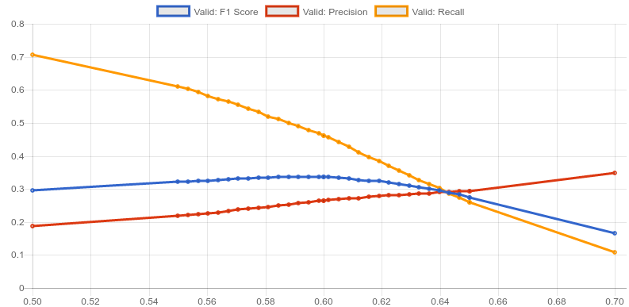
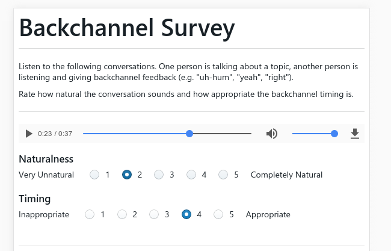
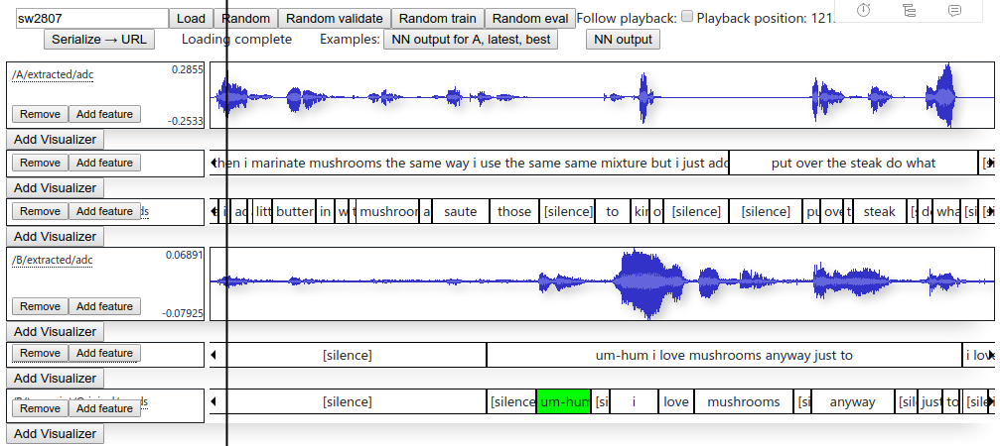
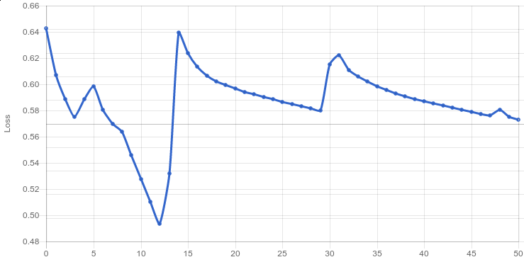
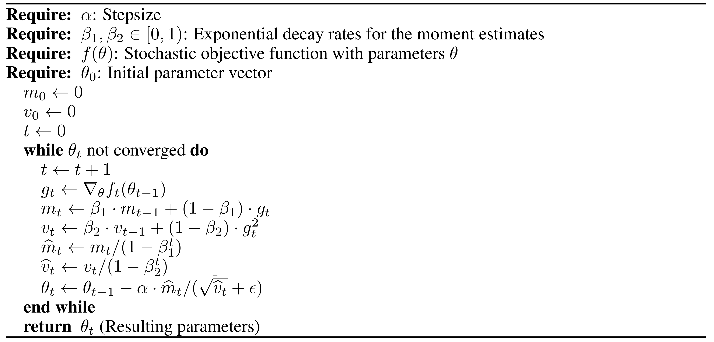
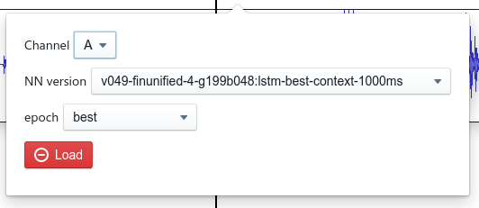
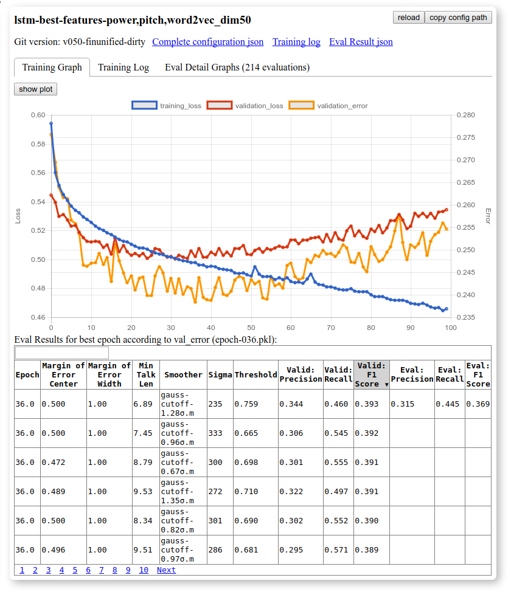
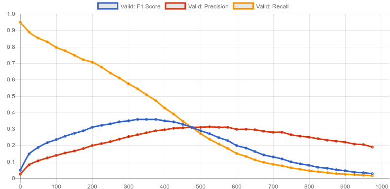
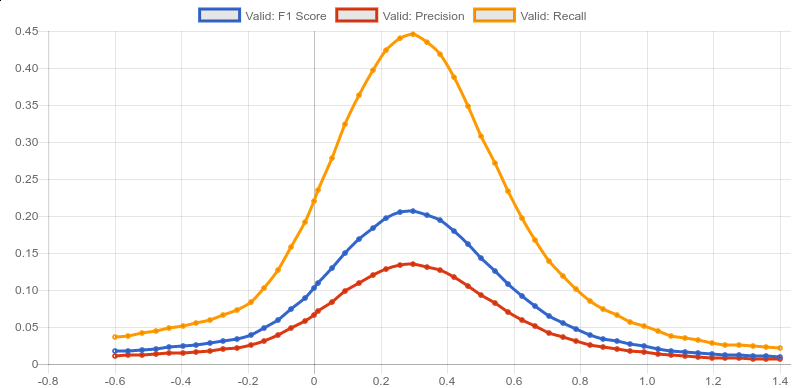
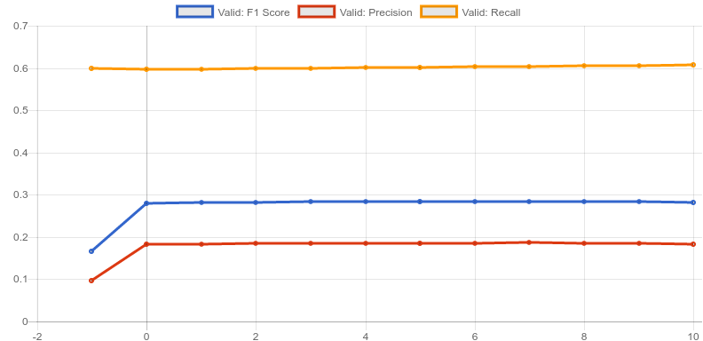

---
# this document is pandoc-1.19-flavored markdown
author:
- 'Robin'
bibliography:
- 'bib.bib'
lang: en-US
title: |
    Backchannel Prediction for Conversational Speech Using Recurrent Neural
    Networks
figPrefix: ["Figure", "Figures"]
tblPrefix: ["Table", "Tables"]
secPrefix: ["Section", "Sections"]
---

# Introduction

When listening to someone, we find ourselves wanting to express sympathy or to acknowledge or reject what we are being told. This form of feedback is called a _backchannel_. The term stems from the idea that we complement the dominant channel of the conversation by the speaker with a secondary response channel. While the dominant channel directs the primary speech flow, the backchannel provides feedback about the current state of the listener with regards to their interest and opinion about the conversation topic.

A backchannel is generally defined as any kind of feedback a listener
gives a speaker as an acknowledgment in a segment of conversation that is primarily one-way.
They include but are not limited to nodding [@watanabe_voice_1989], a shift in the gaze direction, and short phrases (“uh-huh”, “hum", “yeah", “right”, etc.). Backchannels are said to help build rapport, which is the feeling of comfortableness or being "in sync" with conversation partners [@huang_virtual_2011].
Artificial assistants like Siri, Alexa, etc. are becoming increasingly popular, but they are still distinctively non-human. Social dialogs are much less well understood than goal-directed ones. They do not necessarily aim for a particular outcome, other than indirect goals of building sympathy, bonding or mutual entertainment. Adding backchannel responses could help make a conversation with an artificial assistant feel more natural.

We concentrates on short phrasal backchannels consisting
of a maximum of three words. We try to predict these for a given speaker
audio channel in a causal way, using only past information. This allows the predictor to be used in an online environment. This thesis is structured as follows. In @sec:related-work, we provide an overview of related research. In @sec:theoretical, we show our general approach, describing our methods for extraction, training, postprocessing and evaluation. @sec:experiments is a detailed description of the experiments we conducted. The results of these experiments are shown in @sec:results. @sec:implementation contains descriptions and technical details of the software components we implemented in the course of this thesis.

# Related Work {#sec:related-work}

Most related work is either completely rule-based or uses at least some manual components in combination with data-driven learning.
@ward_prosodic_2000 were the first to propose specific rules for when to produce backchannel feedback based on acoustic cues:

> "[...] we formulate
> the following predictive rule for English:
> 
> Upon detection of
> 
> - a region of pitch less than the 26th-percentile pitch level and
> - continuing for at least 110 milliseconds,
> - coming after at least 700 milliseconds of speech,
> - providing you have not output back-channel feedback within the preceding 800 milliseconds,
> - after \SI{700}{ms} wait,
>
> you should produce back-channel feedback." [@ward_prosodic_2000]

These rules contain many variables tuned for English speech, based on the general pitch and pause information. They were used as a basis and a comparison in many following publications. In general, most related work is based on some variations of pitch and pause, for example [@morency_probabilistic_2010] extracted multiple different pitch slope features and binary pause regions and then trained sequential probabilistic models like Hidden Markov Models or Conditional Random Fields to extract the relevant subset of those features. They additionally included eye gaze and head movement features, which increased their F1-Score from 0.206 with only acoustic features to 0.221. [@takeuchi_timing_2004] trained a decision tree with the C4.5 learning algorithm to distinguish between backchannel responses, turn-taking and turn-keeping without a backchannel.

A lot of related research is based on Japanese speech [@okato_insertion_1996] [@ward_using_1996] [@ward_prosodic_2000] [@fujie_conversation_2004] [@takeuchi_timing_2004] [@kitaoka_response_2005] [@nishimura_spoken_2007]. Some is based on English speech [@ward_prosodic_2000] [@morency_predicting_2008] [@de_kok_multimodal_2009] [@huang_learning_2010] [@ozkan_concensus_2010] [@ozkan_latent_2010], and some on Dutch speech [@morency_probabilistic_2010] [@de_kok_learning_2010].


Rule-based approaches can be inflexible, error-prone and involve a lot of manual fine-tuning. A first approach for distinguishing different speech acts, including BCs, using a combination of hidden markov models and neural networks was proposed by @ries_hmm_1999.
Previous work at this institute also includes using a feed-forward neural network for backchannel detection [@mueller_using_2015], though this work focused on offline "prediction", meaning their input features included sections of audio happening during or after the backchannel, making it unsuitable for a real-time environment.

@de_kok_survey_2012 compared different evaluation metrics for backchannel predictors. As an objective evaluation method, the use of the F1-Score has been established. Most research uses a fixed margin of error to accept a prediction as correct. The width of this margin ranges from \SI{400}{ms} to \SI{1000}{ms}, and the center of the margin of error ranges from $\pm\SI{0}{ms}$ to +\SI{500}{ms}. This means some research accepts a far larger latency (up to one second) than other research (up to \SI{200}{ms}). Together with the fact that no one standard data set exists, this makes a comparison between different evaluation results hard.
<!--
Collection:


- @watanabe_voice_1989-1
    - not found
- @okato_insertion_1996
    - Languages: Japanese
    - Truth type: utterances
    - Features: Pause, Pitch
    - Method: HMM for pitch contour
    - 
    - Evaluation Method: 
    - Margin of Error: (-\SI{100}{ms}, +\SI{300}{ms}) from target utterance end (?)
- @ward_using_1996
    - Japanese
- @noguchi_prosody-based_1998
    - Languages: Japanese
    - Features: Prosodic (pause, frequency F0)
- @ward_prosodic_2000
    - English, Japanese
    - Features: Low Pitch Cue, Pause
    - Margin of error: (-500, 500)

- @cathcart_shallow_2003
    - English
    - Features: trigrams, pauses
    - Corpus: HCRC Map Task Corpus
    - Eval Method: Precision, recall, F1

- @fujie_conversation_2004
    - Japanese
    - Features: utterances, prosodic
- @takeuchi_timing_2004
    - Japanese
    - features: porosodic
    - Method: decision tree, C4.5 learning algorithm
    - Corpus: SIG of Corpus-Based Research for Discourse and Dialogue, JSAI, 1999. ”Constructing a spoken dialogue dorpus as sharable research resource”
    - Eval method: recall, precision
- @kitaoka_response_2005
    - Japanese
    - Pitch, pause,
    - Eval: precision, recall, F1

- @nishimura_spoken_2007
    - Japanese
    - Features: Speech recog, 
- @morency_predicting_2008
    - English
    - Features: Eye gaze, low pitch, pause
    - HMM, CRF
    - Margin of error: happens during actual BC utterance
- @de_kok_multimodal_2009
    - English
    - Features: dialog, attention, head gestures, prosody (pitch, pause, etc)
    - Margin: peak in our probabilities (see Section 3) occurs during an actual end-of-speaker-turn.
- @morency_probabilistic_2010
    - Dutch
    - Corpus: MultiLis corpus
    - Special: building consensus Fconsensus
- @de_kok_learning_2010
    - Dutch
- @huang_learning_2010
    - Subjective, on live corpus
    - Fconsensus
    - English
- @ozkan_concensus_2010
    - RAPPORT dataset
    - English
- @ozkan_latent_2010
    - RAPPORT (english)
- @poppe_backchannel_2010
- @de_kok_speaker-adaptive_2013
- @ozkan_latent_2013
- @de_kok_iterative_2014
- @mueller_using_2015-2

-->

# Backchannel Prediction {#sec:theoretical}

## BC Utterance Selection {#sec:extractio:subsec:bc-utterance-selection}

The definition of backchannels varies in literature. There are many different kinds of phrasal backchannels, they can be non-committal ("uh huh", "yeah"), positive / confirming ("oh how neat", "great"), negative / surprised ("you're kidding", "oh my god"), questioning ("oh are you", "is that right"), et cetera.
To simplify the problem, we initially only try to predict the trigger times for any
type of backchannel, ignoring the distinction between different kinds of positive or negative
responses. Later we also try to distinguish between a limited set of
categories.

## Feature Selection

The most commonly used acoustic features in related research are fast and
slow voice pitch slopes and pauses of varying lengths 
[@ward_prosodic_2000; @truong_rule-based_2010; @morency_probabilistic_2010]. A neural network is able to learn advantageous feature representations on its own. This means we can feed it the absolute pitch and
power (signal energy) values for a given time context, from which the network is able to
automatically extract the pitch slopes and pause triggers by subtracting the neighboring values in the time context for each feature.

We also evaluated using other tonal features used for speech recognition in addition to and instead of pitch and power.
The first feature is the fundamental frequency variation spectrum (FFV) [@laskowski_fundamental_2008], which is a representation of changes in the fundamental frequency over time, giving a more accurate view of the pitch progression than the single-dimensional pitch value, which can be very noisy.

Other features we tried include the Mel-frequency cepstral coefficients (MFCCs) with 20 dimensions, and various combinations of all of the above<!-- and a set of bottleneck features trained on phoneme recognition using a feed forward neural network, which is used for speech recognition at the Interactive Systems Lab-->.

## Training Area Selection {#sec:selection}

We generally assume to have two separate but synchronized audio tracks, one for the speaker and one for the listener, each with the corresponding transcriptions.
We need to choose which areas of audio we use to train the network. As we
want to predict the backchannel without future information (also called _causally_ or
_online_), we need to train the network to detect segments of audio
from the speaker track that probably cause a backchannel in the listener
track.

### Binary Training Areas {#sec:binary}

The easiest method is to choose the beginning of the utterance in the transcript of the listener channel as an anchor $t$, and then use a fixed context range of width $w$ before that as the audio range $[t-w, t]$ to train the network to predict a backchannel. The width can range from a few hundred milliseconds to multiple seconds. We feed all the extracted features for this time range into the network at once, from which it will predict if a backchannel at time $t$ is appropriate. This approach of selecting the training area is easy because it only requires searching for all backchannel utterance timestamps and then extracting the calculated range of audio. It may not be optimal though, because the delay between the last utterance of the speaker and the backchannel can vary significantly in the training data. This means it is not guaranteed that the training range will contain the actual trigger for the backchannel, which is assumed to be the last few words said by the speaker, and even if it does the last word will not be aligned within the context. This causes the need for the network to first learn to align it's input, making training harder and slower.

The second method is to use the last few words before a backchannel as the anchor in the hope of directly aligning the input so the actual trigger of the backchannel is always aligned within the training range.
We could for example extract the center of the last speaker utterance before the backchannel ($:=t$), and then use $[t-0.5s, t+0.5s]$ as the training range. In reality this proved to be hard because without manual alignment it isn't clear what the last relevant utterance even is, and in many cases the relevant utterance ends after the backchannel happens, so we would need to be careful not to use any future data. The first approach seemed to work reasonably well, so we did not do any further experiments with the second approach.


In addition to selecting the _positive prediction area_ as defined above, we also need to choose areas to predict zero i.e. “no backchannel” (NBC). The number of training samples of this kind should be about the same amount as backchannel samples so the network is not biased towards one or the other.
To create this balanced data set, we can choose the range a few seconds before each backchannel as a negative sample. This gives us an exactly balanced data set, and the negative samples are intuitively meaningful, because in that area the listener explicitly decided not to give a backchannel response yet, so it is sensible to assume whatever the speaker is saying is not a trigger for backchannels.

### Gaussian Training Area

The method of choosing the training areas described in @sec:binary assumes we train the network on binary values, with 1 = 100% = "Backchannel happens here" and 0 = 0% = "Definitely no backchannel happens here".
Another approach for choosing a training area would be to not choose two separate areas to predict binary 1 and 0 values, but to instead use the area around every actual backchannel trigger and train the network on a bell curve with the center being at the ground truth with the maximum value of 1, and lower values between 0 and 1 for later and earlier values. For example, if there is a backchannel at $t=\SI{5}{s}$ and we identify $t=\SI{4.5}{s}$ as the actual trigger time, we could train the network on output=1 for a context centered at $\SI{4.5}{s}$ 0.5 for \SI{200}{ms} earlier and later and on $0 < \text{output} \ll 1$ for more distant times. This has the same problem as described above in that we would need to know the exact time of the event that triggered the backchannel. Testing this approach by simply using a fixed offset before the onset of the backchannel utterance gave far worse results than the binary training approach, so we discarded the idea in favor of concentrating on finding the optimal context ranges for the binary approach.

## Neural Network Design and Training {#sec:training}

We initially used a simple feed forward network architecture. The input layer consists of
all the chosen features over a fixed time context. With a time context of $c\,\si{ms}$ and a feature dimension of $f$, this gives us an input dimension of $f \cdot \floor{c \over \SI{10}{ms}}$.
One or more hidden
layers with varying numbers of neurons follow. After every layer we apply an activation function (also called a _nonlinearity_) like tanh or a rectifier (ReLU). 
The output layer is
$(n+1)$--dimensional, where n is the number of backchannel categories we
want to predict. This layer has softmax as an activation function, which maps a $K$-dimensional vector of arbitrary values to values that are in the range $(0, 1]$ and that add up to 1, which allows us to interpret them as class probabilities.

We then calculate categorical cross-entropy of the output values of the network and the ground truth from the training data set. This gives us the loss function as the function mapping from the network inputs to the cross-entropy output. We can now train the parameters of the network by deriving it individually for each of the neurons and descending the resulting gradient using the back-propagation algorithm [@rumelhart_learning_1986].

In the simplest case (ignoring different kinds of backchannels) we train the network on the outputs $[1, 0]$ for backchannels and $[0, 1]$ for non-backchannels. When evaluating we can ignore the second dimension of this output, simply interpreting the first dimension as a probability. A visualization of this architecture can be seen in @fig:nn_2h. In the following sections we will concentrate on this architecture.

\input{img/net1}

The placement of backchannels is dependent on previous backchannels: If
the previous backchannel utterance was a long time ago, the probability of a
backchannel happening shortly is higher and vice versa. To accommodate for this, we want
the network to also take its previous internal state or outputs into
account. We do this by modifying the above architecture to use
Long-short term memory layers (LSTM) instead of dense feed forward layers. LSTM neurons are recurrent, meaning they are connected to themselves in a time-delayed fashion, and they have an internal state cell which is transmitted through time and which has set and clear functions which are triggered by any combination of their inputs. LSTM networks are trained in similar fashion as feed forward networks, with the time-stacked layer instances unrolled into individual copies with shared parameters before applying the backpropagation algorithm.

## Postprocessing

Our goal is to generate an artificial audio track containing utterances such as "uh-huh" or "yeah" at appropriate times. The neural neural network gives us a noisy value between 0 and 1, which
we interpret as the probability of a backchannel happening at the given
time. To generate an audio track from this output, we need to convert the noisy floating probability value into discrete trigger timestamps. We first run a low-pass filter over the network output, which removes all the higher frequencies and gives us
a less noisy and more continuous output function. 

### Low-pass Filtering

To ensure our predictor does not use any future information, the low-pass filter must be causal. A common low-pass filter is the gaussian blur, which folds the input function with a bell curve. This filter is symmetric, which in our case means it uses future information as well as past information. To prevent this, we cut the filter of asymmetrically for the right side (that would range in the future), with a cutoff at some multiple $c$ of the standard deviation $\sigma$. Then we shift the filter to the left so the last frame it uses is $\pm\SI{0}{ms}$ from the prediction target time. This means the latency of our prediction increases by $c\cdot\sigma\,ms$. If we choose $c=0$, we cut off the complete right half of the bell curve, meaning we do not need to shift the filter, which keeps the latency at 0 at the cost of accuracy of the low-pass filter.

Another possible filter to use would be exponential smoothing, defined as $s(t) = p\cdot f(t) + (1-p)\cdot s(t-1)$, where $t$ is the current time, $f$ is the original function, $s$ is the smoothed output, and $0<p<1$ is a factor describing the weighing of the current value as opposed to the past values. Even though this has the advantage of producing no latency it performed worse than the gaussian filter even with a cutoff of $c=0$. A third possibility is the Kalman Filter [@kalman_new_1960], which generally tries to predict the value of a function based on a noisy function masking the actual function. This filter has many parameters requiring tuning, so we used the described gaussian filter method instead.

### Thresholding and Triggering {#sec:threshold}

After this filter we use a fixed trigger threshold to extract the ranges in the output where the predictor is fairly confident that a backchannel should happen. We trigger exactly once for each of these ranges.
Within each range we have multiple possibilities to choose the exact trigger time point.

The easiest method is to use the time of the maximum peak of every range where the value is larger than the threshold, but this requires us to wait until the value is lower than the threshold again before we can decide where the maximum is, which introduces another delay and is thus bad for live detection.

Another possibility is to use the start of the range, but this can give us worse results because it might force the trigger to happen earlier than the time the network would give the highest probability rating.

A compromise between the best quality and immediate decision is to use the first local maximum within the thresholded range. Because of the low-pass filter we mostly have no or few local maxima which differ from the global maximum within the given range so this should give results close to using the global maximum. We can decide when the local maximum was reached by triggering as soon as the first derivate is $<0$.

When we have the trigger anchor, we can either immediately trigger, or delay the actual trigger by a fixed amount of time, which can be useful if we notice the prediction would happen too early otherwise.

An example of this postprocessing procedure can be seen in @fig:postproc.

{#fig:postproc}


<!--\begin{figure}
    \centering
    \includegraphics[width=\textwidth]{img/postprocessing.pdf}
    \caption{}
    \label{fig:postproc}
\end{figure}-->


## Evaluation

For a simple subjective assessment of the results, we take some random audio segments where one person is talking in a monologue. For each segment, we remove the original listener channel and replace it with the artificial one. This audio data is generated by inserting a random backchannel audio sample at every predicted timestamp. We get these audio samples from a random speaker from the training data, keeping the speaker the same over the whole segment so it sounds like a specific person is listening to the speaker.

### Objective Evaluation

To get an objective evaluation of the performance of our predictions, we take a set of
monologuing segments from the evaluation data set and compare the prediction
with the ground truth, i.e., all the timestamps where a backchannel happens in the original data.

We interpret a prediction as correct if it is within a specific margin of the nearest real backchannel in the dataset. For example, with a margin of error of $[\SI{-100}{ms}, \SI{+300}{ms}]$, if the real data has a backchannel at a timestamp of 5.5 seconds from the beginning of the conversation, we say the predictor is correct if it also produces a backchannel within $[\SI{5.5}{s} - \SI{100}{ms}, \SI{5.5}{s} + \SI{300}{ms}] = [\SI{5.4}{s}, \SI{5.8}{s}]$.

In other research, varying margins of error have been used. We use a margin of \SI{0}{ms} to $+1000\,\si{ms}$ for our initial tests, and later also do our evaluation with other margins for comparison with related research.

After aligning the prediction and the ground truth using the margin of error, we get two overlapping sets of timestamps. The set of predictions is called "selected elements" and the set of true elements is called "relevant elements". The number of true positives is defined as $\mathit{TP} = |\mathit{selected} \cap \mathit{relevant}|$, which is all the backchannels the predictor correctly identified as such. The number of false positives is defined as $\mathit{FP} = |\mathit{selected} \setminus \mathit{relevant}|$, which is all the backchannels the predictor output that are not contained in the actual dataset. The number of false negatives is defined as $\mathit{FN} = |\mathit{relevant} \setminus \mathit{selected}|$, which is all the backchannels that the predictor should have found but didn't.

With these, we can now calculate the measures _Precision_ and _Recall_ as commonly used in information retrieval and binary classification:


\begin{align}
    \mathit{Precision} & = {\mathit{TP} \over \mathit{TP} + \mathit{FP}} \\[1em]
    \mathit{Recall} & = {\mathit{TP} \over \mathit{TP} + \mathit{FN}}
\end{align}

Both of these are values between 0 and 1. The _Precision_ value is the fraction of returned values that were correct, and can thus be seen as a measure of the _quality_ of a algorithm. The _Recall_ value, also known as _Sensitivity_ is the fraction of relevant values that the algorithm output, thus it can be interpreted as a measure of _quantity_. Precision and Recall are in a inverse relationship, and it is usually possible to increase one of them while reducing the other by tweaking parameters of the algorithm. An example of this can be seen in @fig:varythreshold. Recall can be easily maximized to 100% by simply returning true for every given timestamp. <!--Precision can be maximized by never outputting anything, causing every predicted value to be correct. -->To solve this problem and to introduce a single scalar for measuring the performance, we use the normalized harmonic mean of precision and recall, also known as the F1-Score or F-Measure, as defined in @eq:abc.

$$
\text{F1\,Score} = 2 \cdot \frac{1}{\frac{1}{\mathit{Recall}} + \frac{1}{\mathit{Precision}}}
    = 2 \cdot \frac{\mathit{Precision}\cdot\mathit{Recall}}{\mathit{Precision}+\mathit{Recall}}
$${#eq:abc}

We use the F1-Score to objectively measure the performance of our prediction systems.

{#fig:varythreshold}

### Subjective Evaluation

Because the placement of backchannels is subjective, we did a subjective evaluation to complement the objective data.
We first extracted all monologuing segments of more than fifteen seconds from the evaluation data set where the ground truth contained at least three backchannels. Then we randomly picked six of these, excluding those that contained noise leaking from from one channel to the other. The picked segments were of an average length of 30 seconds. For each segment, we generated three versions of audio:

1. Neural net predictor: Predictions from our best trained LSTM according to the objective evaluation
2. Ground truth predictor: Predictions as read from the real backchannel audio track
3. Random predictor (baseline): For each segment, we read the real backchannel count, and then uniformly distributed those throughout the segment. Note that this method actually has additional information compared to the neural net predictor because it knows the expected backchannel count.

For each of these, we generated the backchannel audio track by putting a backchannel audio sample at each trigger time. We then down-mixed the speaker and artificial listener channel to mono mp3 file to maximize accessibility.
We chose the backchannel audio samples randomly from all neutral backchannels with a minimum loudness in a fixed set of 11 conversations that had a lot of neutral backchannels without leaking audio.

This gave us a total of $6\cdot3=24$ audio files. For every participant we randomly selected six audio files so that everyone heard every speaker track exactly once and two samples of every method (Truth, Random, NN). The order was shuffled to remove any structural effects.
Then we asked the participants to rate the audio samples by how natural it sounded in general and how appropriate they thought the backchannel timing was. A screenshot of the survey interface can be seen in @fig:bcsurvey.

{#fig:bcsurvey}


<!--First, we evaluated human performance with the same evaluation method we used for our predictors.
Participants first chose a backchannel track. Whenever they pressed the spacebar, a random audio sample from their selected track would play. Then they listened to ten monologuing audio segments of more than 15 seconds and could give backchannel responses.
The results of this were combined to calculate the average F1-Score of humans.-->

# Experimental Setup {#sec:experiments}

## Dataset

We used the switchboard dataset [@godfrey_switchboard-1_1993] which consists of 2438 english
telephone conversations of five to ten minutes, 260 hours in total.
Pairs of participants from across the United States were encouraged to talk about a specific topic selected from 70 possibilities. Conversation partners and topics were selected so two people would only talk once with each other and every person would only discuss a specific topic once.
These telephone conversations are annotated with transcriptions and word alignments [@harkins_isip_2003] with a total of 390k utterances or 3.3 million words. The audio data is given as stereo files, where the first speaker is on the left channel and the second speaker on the right channel. We split the dataset randomly into 2000 conversations for training, 200 for validation and 238 for evaluation. As opposed to many other datasets, the transcriptions also contain backchannel utterances like _uh-huh_ and _yeah_, making it ideal for this task.

The transcriptions are split into _utterances_, which are multiple words grouped by speech structure, for example (slashes indicate utterance boundaries): "did you want me to go ahead / okay well one thing i- i- i guess both of us have very much aware of the equality / uh it seems like women are uh just starting to really get some kind of equality not only in uh jobs but in the home where husbands are starting to help out a lot more than they ever did um". The length of these utterances varies in length from one word to whole sentences. Each of them has a start time and stop time attached, where the stop time of one utterance is always the same as the start time of the next utterance. For longer periods of silence, an utterance containing the text  "[silence]" is between them.

The word alignments have the same format, except they are split into single words, each with start and stop time. Here the start and stop times are mostly exactly aligned with the actual word audio start and end. _[silence]_ utterances are between all words that have even a slight pause between them.

To better understand and visualize the dataset, we first wrote a complete visualization GUI for viewing and listening to audio data, together with transcriptions, markers and other data. This proved to be very helpful. A screenshot of the UI inspecting a short portion of one of the phone conversations can be seen in @fig:amazing.

{#fig:amazing}

## Extraction {#extraction-1}

### Backchannel Utterance Selection

We used annotations from The Switchboard Dialog Act Corpus [@jurafsky_switchboard_1997] to
decide which utterances to classify as backchannels. The SwDA contains
categorical annotations for utterances for about half of the data of the
Switchboard corpus. An excerpt of the most common categories can be seen in @tbl:swda.

\begin{figure}
\centering
\begin{tabular}{cp{3cm}cp{4cm}r}
    \hline\noalign{\smallskip}

    ~ & name & act\_tag & example & full\_count \\

    \noalign{\smallskip}\svhline\noalign{\smallskip}

    1 & Statement-non-opinion & sd & Me, I'm in the legal department. &  75145\tabularnewline
    2 & Acknowledge (Backchannel) & b & Uh-huh. &  38298\tabularnewline
    3 & Statement-opinion & sv & I think it's great &  26428\tabularnewline
    4 & Agree/Accept & aa & That's exactly it. &  11133\tabularnewline
    5 & Abandoned or Turn-Exit & \% & So, - &  15550\tabularnewline
    6 & Appreciation & ba & I can imagine. &  4765\tabularnewline
    7 & Yes-No-Question & qy & Do you have to have any special training? &  4727\tabularnewline

    \noalign{\smallskip}\hline\noalign{\smallskip}
\end{tabular}
\caption{Most common categories from the SwDA Corpus}
\label{tbl:swda}
\end{figure}

We extracted all utterances containing one of the tags beginning with "b" (which stands for backchannels or backchannel-like utterances), and counted their frequency. Because the dataset also marks some longer utterances as backchannels, we only use those that are at most three words long to exclude the ones that transmit a lot of additional information to the speaker.

We chose to use the top 150 unique utterances from this set. For the most common ones, see @tbl:bcs.

\begin{figure}
\centering
    \input{tbl/bcs}
    \caption{Most common backchannel utterances in the SwDA dataset. bk = Response Acknowledgement, bh = Backchannel in question form, ba = Appreciation.\label{tbl:bcs}}
\end{figure}


The SwDA is incomplete, it only contains labels for about half of the Switchboard dataset. Because we wanted to use as much training data as possible, we had to identify
utterances as backchannels just by their text. As can be seen in @tbl:bcs, the SwDA also has some silence utterances marked as backchannels, as well as only laughter and noise, which we can't distinguish from normal silence, so we ignore them altogether. We manually removed some
requests for repetition like (e.g. “excuse me”) from the SwDA list, and added some
other utterances that were missing from the SwDA transcriptions but
present in the original transcriptions, by going through the most common
utterances and manually selecting those that seemed relevant, including but not limited to "um-hum yeah", "absolutely", "right uh-huh".

In total we now had a list of 161 distinct backchannel utterances. The most common backchannels in the data set are “yeah”, “um-hum”,
“uh-huh” and “right”, adding up to 41860 instances or 68% of all
extracted backchannel phrases.

The transcriptions also contain markers indicating laughter while talking (e.g. `i didn't think that well we wouldn't still be [laughter-living] [laughter-here] so ...`),
laughter on its own (`[laughter]`), noise markers (`[noise]`) for microphone crackling or similar, and markers for different pronunciations (for example "mhh-kay" is transcribed as `okay_1`).
To select which utterances should be categorized as backchannels and
used for training, we first filter noise and other markers from the
transcriptions (e.g. `[laughter-yeah] okay_1 [noise]` becomes
`yeah okay`) and then compare the resulting text to our list of backchannel phrases.

Some utterances such as _uh_ can be both backchannels and speech
disfluencies. For example: "... pressed a couple of the buttons up in the / uh / the air conditioning panel i think and uh and it reads out codes that way". Note that the first _uh_ is it's own utterance and would thus be seen by our extractor as a backchannel. The second occurrence of _uh_ has normal speech around in the same utterance it so we would already ignore it. We only want those utterances that are actual backchannels, so after filtering by utterance text we only choose those that have either silence or another backchannel before them.

This gives us the following selection algorithm:
```python
def is_backchannel(utterance):
    if index(utterance) == 0:
        # no other utterance before this, can't be a backchannel
        return False
    text = noise_filter(utterance)
    previous_text = noise_filter(previous(utterance))
    return (text in valid_backchannels and
            (is_silent(previous_text) or
             is_backchannel(previous(utterance)))
```

This method gives us a total of 62k
backchannels out of 390k utterances (16%) or 71k out of 3.2 million
words (2.2%). Note that the percentage of words is much lower because backchannel utterance are on average much shorter than other utterances.

### Feature Extraction


#### Acoustic Features

We used the Janus Recognition Toolkit [@levin_janus-iii_2000] for the acoustic feature extraction (power, pitch tracking, FFV, MFCC). The power value used is the base-10 logarithm of the raw `adc2pow` value output by the Janus Recognition Toolkit (JRTk). The pitch value is the raw value output by the Janus pitch tracker. All features are normalized so they fit in the range of $[-1, 1]$. For FFV, we used the default JRTk configuration of seven dimensions, for MFCCs the default configuration of 20 dimensions.
These features are extracted for \SI{32}{ms} frame windows, with a frame shift of \SI{10}{ms}. This gives us 100 frames per feature per second.
A sample of the pitch and power features can be seen in @fig:pitchpow.

{#fig:pitchpow}


#### Linguistic Features

In addition to these prosodic features, we also tried training Word2Vec [@mikolov_efficient_2013] on the Switchboard dataset.
Word2Vec is an "Efficient Estimation of Word Representations in Vector Space". After training it on a lot of text, it will learn the meaning of the words from the contexts they appear in, and then give a mapping from each word in the vocabulary to an n-dimensional vector, where n is configurable. Similar words will appear close to each other in this vector space, and it's even possible to run semantic calculations on the result. For example calculating $\mathit{king} - \mathit{man} + \mathit{woman}$ gives the result $=\mathit{queen}$ with a high confidence. Because our dataset is fairly small, we used relatively small word vectors (10 - 50 dimensions). Word2Vec automatically chooses a fitting vocabulary size. For words not in the vocabulary, we output 0 on all dimensions. We trained Word2Vec only on utterances that are not backchannels or silence to reduce the required vocabulary and prevent it from learning about meta information such as pauses, noises and laughter on its own.

We extracted these features parallel to those output by Janus, with a 10 millisecond frame shift. To ensure we don't use any future information, we extract the word vector for the last word that ended _before_ the current frame timestamp. This way the predictor is in theory still online, though this assumes the availability of a speech recognizer with instant output. An example of this can be seen in @fig:w2v.

{#fig:w2v}

#### Context and Stride

We extracted the features for a fixed time context. Then we used a subset of that range as the area we feed into the network. 
As an example, we could extract the range $[\SI{-2000}{ms}, \SI{0}{ms}]$ for every feature, giving us 200 frames. To train the network on \SI{1500}{ms} of context, we would treat every offset like $[\SI{-2000}{ms},\allowbreak \SI{-500}{ms}],\allowbreak [\SI{-1990}{ms},\allowbreak \SI{-490}{ms}], \dots,\allowbreak [\SI{-1500}{ms}, \SI{0}{ms}]$ as individual training samples. This would give us 50 training samples per backchannel utterance, greatly increasing the amount of training data, but introducing smear as the network needs to learn to handle a larger variance in when the backchannel cue appears in its inputs, and thus reducing the confidence of its output.

This turned out to not work very well, so in the end we settled on only extracting the features for the range $[-w - \SI{10}{ms}, \SI{0}{ms}]$ where $w$ is the context width, and training the network on $[-w - \SI{10}{ms},\allowbreak \SI{10}{ms}]$ and $[-w, \SI{0}{ms}]$. This gives us two training samples per utterance, reduces the smearing problem and at the same time forces the network to learn to correctly handle when its inputs are the same or similar but offset by one.

We can also choose to only use every n-th timestep, which we call the "context stride". This works under the assumption that the input features don't change with a high frequency, which greatly reduces the input dimension and speeds up training. In practice a stride of 2 worked well, meaning one frame every 20 milliseconds. This works great in combination with the above. For example, with a stride of 2 and a context size of \SI{100}{ms}, we would now get these two training samples (described as frame indices relative to the onset of the backchannel utterance):

1. [-10, -8, -6, -4, -2, 0]
2. [-11, -9, -7, -5, -3, -1]

## Training {#training-1}

We used Theano [@theano_development_team_theano:_2016] with Lasagne v1.0-dev [@dieleman_lasagne:_2015] for rapid prototyping
and testing of different parameters. We trained a total of over 200
network configuration with various context lengths (\SI{500}{ms} to \SI{2000}{ms}),
context strides (1 to 4 frames), network depths (one to four hidden layers), layer sizes (15 to 125 neurons), activation functions (tanh and relu), optimization methods (SGD, Adadelta and Adam [@kingma_adam:_2014]), weight initialization methods (constant zero and Glorot [@glorot_understanding_2010]), and layer types (feed forward and LSTM).

In general, we used three variables to monitor training: The first is training loss, which is what the network optimizes, as defined in @sec:training. We expect this variable to decrease more or less monotonically while training, because the network is descending it's gradient. The second variable is validation loss, which is the same function a training loss, but on the separate validation data set. This allows us to tell whether the network is still learning useful information or starting to overfit. In general, we expect this to be about the same as the training loss, possibly a bit higher. If the training loss is still falling but validation loss is starting to increase again, the network is overfitting on the training data.

 The third variable is the validation error, which we define as $$1 - {\sum_{s \in S}\{1 \text{ if prediction}(s) = \text{truth}(s)\text{ else }0\} \over |S|},$$ where $S$ is all the frames for all the samples in the validation data set, and $\allowbreak\text{prediction}(s) = \text{argmax}(\text{output})$. This means we take the network output, convert it into the category the network is currently most confident in, and compare it with the ground truth. For example, say we are training with two outputs, one for "Non BC" and one for "BC". The network will always give us two values between 0 and 1 that add up to one because of the softmax function as described in @sec:training. If the network output is [0.7, 0.3] for a specific sample we interpret it as "Non BC", because the confidence in the "Non BC" category is higher. If the ground truth for this sample is also "Non BC", the validation error is 0, otherwise 1.
 This gives us a statistical rating of the current state of the predictor that has less resolution than the loss function (because it throws away the "confidence" of the network), but is closer to our interpretation of the network output when evaluating. We use this value as an initial comparison between predictors and to decide which epoch of the network will probably give the best results. We will use a different threshold than 0.5 for evaluation, so the validation error is not a completely accurate measurement.

We train the network in epochs of minibatches. A minibatch is a set of $N$ training samples that we feed into the network at once, updating the weights with their average loss. This means we only update the gradient every $N$ training samples, which reduces the probability of a single huge gradient disturbing training. We used a minibatch size of $N=250$ training samples. One epoch is defined as one whole backward pass of all the training data through the network.

We started with a simple model with a configuration of pitch and power as input and \SI{800}{ms} of context, giving us $80\cdot 2 = 160$ input dimensions, hidden layers of 100 $\rightarrow$ 50 feed forward neurons. We trained this using many different gradient descent methods such as stochastic gradient descent (SGD), SGD with momentum, Nesterov momentum, Adadelta and Adam, each with fixed learning rates to start. The momentum methods add a speed variable to the descent. This can be interpreted similar to its physical name giver. Imagine a ball rolling down a mountain slope, for each time period, it keeps it's previous momentum and is thus able to jump over small dents in the ground (local minima). In our case, momentum worsened the results, so we stayed with SGD and Adam. 

We tried different weight initialization methods. Initializing all weights with zero gave significantly worse results than random initialization, so we stayed with the Lasagne default of Glorot uniform initialization, which uses uniformly distributed random values, with the maximum value scaled so it makes statistical sense with the used layer dimension [@glorot_understanding_2010]. Another method to use would be layer-wise denoising autoencoder pretraining. With this method, the initial weights are created by training the layers individually to reproduce the input data with some dropout. The first layer is trained on its own, the second layer is trained with the first layer before it but fixed and so on. We did not try this, but it might give good results for this use case, especially for deeper networks with vanishing gradients.

We compared online prediction and offline "prediction", where offline prediction got \SI{400}{ms} of past audio and \SI{400}{ms} of future audio from the onset of the backchannel utterance, and online prediction got \SI{800}{ms} of past audio. Offline prediction gave 18% better results, but of course we are more interested in online prediction.

## Recurrent Neural Networks

The first LSTM we tested by simply replacing the feed forward layers with LSTM layers immediately improved the results by 16% without any further adjustments. We kept the default configuration of using "Peepholes" [@gers_learning_2003] and used only forward facing layers (connections from past to future). But this showed the issues with a fixed learning rate, as the gradient regularily exploded after every 10 to 15 epochs, as can be seen in @fig:exploding. When adding FFV, increasing the input dimension per time frame from 2 to 9, SGD stopped working at all (everything became NaN) without manually tuning the learning rate. One solution to this would be to use a scheduler. A scheduler automatically adjusts the learning rate depending on some condition. An example is simple exponential decay, which exponentially decreases the initial learning rate with a fixed factor. Another method is newbob scheduling, which exponentially decreases the learning rate when the validation error stops decreasing or only decreases very little. These schedulers need parameter tuning, making them hard to use without a lot of experimenting.

{#fig:exploding}

We solved the problem of automatically adjusting the learning rate by using Adam [@kingma_adam:_2014] instead of SGD, which is a gradient descent method related to Adadelta and Adagrad which also incorporates momentum in some way and intelligently adjusts the learning rate. I have no idea how this works, but Adam with a fixed learning rate of 0.001 worked great for us, so we did all further testing using Adam.

<!--{#fig:adam}-->


The LSTM networks we tested were prone to overfitting very quickly, but they still
provided better results after two to three epochs than normal feed forward networks after 100 epochs. Overfitting happens when the results still improve on the training data set, but plateau or get worse on the validation data set. This means the network is starting to learn specific quirks in the training data set by heart, which it then can't apply on other data.

We tried two regularization methods to reduce overfitting.
At first we added dropout layers to the networks to try and avoid overfitting and to generally improve the results. Dropout layers randomly disconnect a specified fraction of neurons in a layer, different for every training batch. This should in theory help the network interpret it's inputs even when it is partially "blind", reducing the effective input dimension and thus reducing overfitting. For validation and evaluation the dropout is deactivated, so the network is able to take advantage of every single feature when actually using it as a predictor. In this case, we tried adding different dropout settings such as

$$
\begin{aligned}
 & \text{input} & (20\%\text{ dropout}) \\
\rightarrow & 125 \text{ neurons} & (50\% \text{ dropout}) \\
\rightarrow & 80 \text{ neurons} & (50\% \text{ dropout}) \\
\rightarrow & \text{output} & 
\end{aligned}
$$

but this only increased the noise in the training loss and did not improve the results over a simple "input $\rightarrow$ 70 neurons $\rightarrow$ 45 neurons" configuration, both for feed forward and for LSTM networks.
The solution that worked was L2-Regularization with a factor of 0.0001. L2-Regularization places a penalty on increasing complexity (caused by overfitting) of the learned model by adding the sum of the squares of the weights to the loss function. This reduced the overfitting problem greatly and slightly improved the
results, as can be seen in the example in @fig:l2reg.

{#fig:l2reg}

### Multicategorical Data

Everything above assumes we only predict two categories: Non-BC and BC. To extend this to multiple categories, we can use the same output layer setup with more dimensions, because softmax works for any number of categories. 

We manually separated the data into the categories neutral, question, surprise/negative, affirmative, positive. This gives us six outputs including the Non-BC output, with the distribution shown in @tbl:catcounts.

\begin{figure}
\centering

    \begin{tabular}{cr}
    \hline\noalign{\smallskip}
    Category & sample count \\
    \noalign{\smallskip}\svhline\noalign{\smallskip}
    NBC &  50809 \\
    affirmative & 2052 \\
    neutral & 41153 \\
    positive & 3264 \\
    question & 1200 \\
    surprise/negative & 3140 \\
    \noalign{\smallskip}\hline\noalign{\smallskip}
    \end{tabular}
    \caption{Number of instances in the training data set per category}\label{tbl:catcounts}
\end{figure}

To decide whether to trigger we first check if $(1-\textit{output}_{\text{NBC}}(t))$ is larger than a threshold, where NBC is the output for the category indicating no backchannel should happen. Then we use argmax(output(t)) to decide which backchannel category was predicted.

With this method, the number of training samples for the categories vary, and the NBC category has as many samples as the other categories together. To balance this data, we can weigh the gradient update for each training sample by $w(\textit{sample}) = \max(\textit{counts}) / \textit{counts}(\textit{category}(\textit{sample}))$, where $\textit{counts}(\textit{category})$ is the total number of training samples for a specific category. This means that the training samples with categories that have few samples are more important for training than the more common categories. Alternatively, we can simply duplicate samples from the minority categories until the categories are balanced. Both methods produced similar results.

For training, the simplest method is to just train the whole network on the ground truth for the categories. But because the data is limited, this might not give the best results. Another method is to first train the network on just NBC and BC detecting, then fixing all the layers except the output layer and just fine-tuning the output layer to output multiple categories.

The results for a network trained on a binary output with the last layer finetuned on multicategorical output can be seen in @fig:grayscale.

{#fig:grayscale}

## Evaluation {#eval-1}

The switchboard dataset contains alternating conversation. Because our predictor is only capable of handling situations where one speaker is consistently speaking and the other consistently listening, we need to evaluate it on only those segments. We call these segments "monologuing segments".

For this we define the predicate `is_listening` (is only emitting
utterances that are backchannels or silence) and `is_talking`
(`= not is_listening`). An example of this can be seen in @fig:listening. A monologuing segment is the maximum possible
time range in which one person is consistently talking and the other
only listening. We only consider such segments of a minimum length of five seconds to exclude sections of alternating conversation.
The results did not significantly change when adjusting this minimum length between two and ten seconds, though the amount of evaluation data and thus the accuracy of the evaluation values changed (see @fig:varymonologuing).

{#fig:listening}

An interesting aspect is that in our tests the predictors had difficulty distinguishing segments of speech that indicate a backchannel and those that indicate a turn taking (speaker change). Subjectively this makes sense, because in many cases a backchannel can be seen as a replacement for starting to talk more extensively.

# Results {#sec:results}

## Subjective Results

A total of 20 participants participated in the survey, mostly from the university group _Machine Learning Karlsruhe_. Because every participant rated two samples for every evaluation method, this gives us a sample size of $N=40$. The detailed results of the survey can be seen in @tbl:surveyresults.
The results show that our neural network performs significantly better regarding timing than a random predictor ($p=0.005\%$), but significantly worse than human performance ($p=0.4\%$). For _naturalness_, our predictor is not significantly better than random performance ($p=7.7\%$), as shown in @tbl:surveysig.

Participants could leave comments on the survey. One person was confused because they could still hear the leaking original listener audio track beneath the artificial one, even though we explicitly chosesegments where this problem should be minimal. Another person commented "Telephone conversations are not in the best sound quality. For me it's hard to follow and it's not easy to rate these conversations."

\begin{table}
    \centering
    \input{tbl/surveyResult.tex}
    \caption{Survey results.\label{tbl:surveyresults}}
\end{table}

\begin{table}
    \centering
    \input{tbl/surveySignificance.tex}
    \caption{Comparing performance of the predictors using Welch's t-test on the survey results, showing the differences in the mean of the rating between prediction methods are all significant regarding timing.\label{tbl:surveysig}}
\end{table}

\clearpage

## Objective Results

### Binary Output

We use "$70 : 35$" to denote a network layer configuration of "$\text{input} \rightarrow 70\text{ neurons} \rightarrow 35\text{ neurons} \rightarrow \text{output}$".
All of the results in [@tbl:varycontext;@tbl:varystrides;@tbl:varyfeatures;@tbl:varylayers;@tbl:varylstm] use the following setup if not otherwise stated:

- LSTM
- Configuration: $(70 : 35)$
- Input features: power, pitch, FFV
- Context frame stride: 2
- Margin of error: $0\,\si{ms}$ to $+1000\,\si{ms}$

Precision, recall and F1-Score are given for the validation data set.

We tested different context widths. A context width of $n\,\si{ms}$ means we use the range $[-n\,\si{ms},\allowbreak 0\,\si{ms}]$ from the beginning of the backchannel utterance. The results improved significantly when increasing the context width from our initial value of $\SI{500}{ms}$. Performance peaked with a context of about $\SI{1500}{ms}$, as can be seen in @tbl:varycontext. Longer contexts tended to cause the predictor to trigger too late.


We tested using only every n-th frame of input data. Even though we initially did this for performance reasons, we noticed that training on every single frame has worse performance than skipping every second frame due to overfitting. Taking every fourth frame seems to miss too much information, so performance peaks at a context stride of 2, as can be seen in @tbl:varystrides.

We tested different combinations of features. Using FFV as the only prosodic feature performs worse than FFV together with the absolute pitch value. Adding MFCCs does not seem to improve performance in a meaningful way when also using pitch. See @tbl:varyfeatures for more details. Note that using _only_ word2vec performs reasonably well, because with our method it indirectly encodes the time since the last utterance, similar to the power feature.

@tbl:varylstm shows a comparison between feed forward and LSTM networks. The parameter count is the number of connection weights the network learns in training. Note that LSTMs have significantly higher performance, even with similar parameter counts.
We compared different layer sizes for our LSTM networks, as shown in @tbl:varylayers. A network depth of two hidden layers worked best, but the results are adequate with a single hidden layer or three hidden layers.

In [@tbl:mueller;@tbl:ourbest], our final results are given for the completely independent evaluation data set. We compared the results by Mueller et al. (2015) [@mueller_using_2015] with our system. They used the same dataset, but focused on offline predictions, meaning their network had future information available, and they evaluated their performance on the whole corpus including segments with silence and with alternating conversation. We adjusted our baseline and evaluation system to match their setup. As can be seen in @tbl:mueller, our predictor performs better.
All other related research used different languages, datasets or evaluation methods, making a direct comparison difficult.

@tbl:ourbest shows the results with our presented evaluation method. We provide scores for different margins of error used in other research. Subjectively, missing a BC trigger may be more acceptable than a false positive, so we also provide a result with balanced precision and recall.

\begin{table}
    \centering
    \begin{tabular}{cccc}
    \hline\noalign{\smallskip}
    Context & Precision & Recall & F1-Score \\
    \noalign{\smallskip}\svhline\noalign{\smallskip}
    500\,ms & 0.219 & 0.466 & 0.298 \\
    1000\,ms & 0.280 & 0.497 & 0.358 \\
    1500\,ms & 0.305 & 0.488 & \bf{0.375} \\
    2000\,ms & 0.275 & 0.577 & 0.373 \\
    \noalign{\smallskip}\hline\noalign{\smallskip}
    \end{tabular}
    \caption{Results with various context lengths. Performance peaks at 1500\,ms.}\label{tbl:varycontext}
\end{table}

\begin{table}
    \centering
    \begin{tabular}{cccc}
    \hline\noalign{\smallskip}
    Stride & Precision & Recall & F1-Score \\
    \noalign{\smallskip}\svhline\noalign{\smallskip}
    1 & 0.290 & 0.490 & 0.364 \\
    2 & 0.305 & 0.488 & \bf{0.375} \\
    4 & 0.285 & 0.498 & 0.363 \\
    \noalign{\smallskip}\hline\noalign{\smallskip}
    \end{tabular}
    \caption{Results with various context frame strides.}\label{tbl:varystrides}
\end{table}

\begin{table}
    \centering
    \begin{tabular}{lccc}
    \hline\noalign{\smallskip}
    Features & Precision & Recall & F1-Score \\
    \noalign{\smallskip}\svhline\noalign{\smallskip}
    power & 0.244 & 0.516 & 0.331 \\
    power, pitch & 0.307 & 0.435 & 0.360 \\
    power, pitch, mfcc & 0.278 & 0.514 & 0.360 \\
    power, ffv & 0.259 & 0.513 & 0.344 \\
    power, ffv, mfcc & 0.279 & 0.515 & 0.362 \\
    power, pitch, ffv & 0.305 & 0.488 & \bf{0.375} \\
    \noalign{\smallskip}\hline\noalign{\smallskip}
    word2vec$_{dim=30}$ & 0.244 & 0.478 & 0.323 \\
    power, pitch, word2vec$_{dim=30}$ & 0.318 & 0.486 & 0.385 \\
    power, pitch, ffv, word2vec$_{dim=15}$ & 0.321 & 0.475 & 0.383 \\
    power, pitch, ffv, word2vec$_{dim=30}$ & 0.322 & 0.497 & \bf{0.390} \\
    power, pitch, ffv, word2vec$_{dim=50}$ & 0.304 & 0.527 & 0.385 \\
    \noalign{\smallskip}\hline\noalign{\smallskip}
    \end{tabular}
    \caption{Results with various input features, separated into only acoustic features and acoustic plus linguistic features.}\label{tbl:varyfeatures}
\end{table}

\begin{table}
    \centering
    \begin{tabular}{ccccc}
    \hline\noalign{\smallskip}
    Layers & Parameter count & Precision & Recall & F1-Score \\
    \noalign{\smallskip}\svhline\noalign{\smallskip}
    FF ($56 : 28$) & 40k & 0.230 & 0.549 & 0.325 \\
    FF ($70 : 35$) & 50k & 0.251 & 0.468 & 0.327 \\
    FF ($100 : 50$) & 72k & 0.242 & 0.490 & 0.324 \\
    LSTM ($70 : 35$) & 38k & 0.305 & 0.488 & \bf{0.375} \\
    \noalign{\smallskip}\hline\noalign{\smallskip}
    \end{tabular}
    \caption{Feed forward vs LSTM. LSTM outperforms feed forward architectures.}\label{tbl:varylstm}
\end{table}

\begin{table}
    \centering
    \begin{tabular}{cccc}
    \hline\noalign{\smallskip}
    Layer sizes & Precision & Recall & F1-Score \\
    \noalign{\smallskip}\svhline\noalign{\smallskip}
    $100$ & 0.280 & 0.542 & 0.369 \\
    $50 : 20$ & 0.291 & 0.506 & 0.370 \\
    $70 : 35$ & 0.305 & 0.488 & \bf{0.375} \\
    $100 : 50$ & 0.303 & 0.473 & 0.369 \\
    $70 : 50 : 35$ & 0.278 & 0.541 & 0.367 \\
    \noalign{\smallskip}\hline\noalign{\smallskip}
    \end{tabular}
    \caption{Comparison of different network configurations. Two LSTM layers give the best results.}\label{tbl:varylayers}
\end{table}

\begin{table}
    \centering
    %\caption{Final best results on the evaluation set (chosen by validation set)}\label{tbl:final}
    \begin{tabular}{p{7cm}ccc}
    \hline\noalign{\smallskip}
        Predictor & Precision & Recall & F1-Score \\
        \noalign{\smallskip}\svhline\noalign{\smallskip}
        Baseline (random) & 0.042 & 0.042 & 0.042 \\
        Müller et al. (offline) \cite{mueller_using_2015} & -- & -- & 0.109 \\
        Our results (offline, context of \SIrange{-750}{750}{ms}) & 0.114 & 0.300 & \bf{0.165} \\
        Our results (online, context of \SIrange{-1500}{0}{ms}) & 0.100 & 0.318 & 0.153 \\
    \noalign{\smallskip}\hline\noalign{\smallskip}
    \end{tabular}
    \caption{Comparison with previous research. \cite{mueller_using_2015} did their evaluation without the constraints defined in \autoref{eval-1}, so we adjusted our baseline and evaluation to match their setup.\label{tbl:mueller}}
\end{table}

\begin{table}
    \centering
    \begin{tabular}{cp{5cm}ccc}
    \hline\noalign{\smallskip}
        Margin of Error & Constraint & Precision & Recall & F1-Score \\
        \noalign{\smallskip}\svhline\noalign{\smallskip}
        \SIrange{-200}{+200}{ms} && 0.172 & 0.377 & 0.237 \\
        \SIrange{-100}{+500}{ms} &&	0.239 & 0.406 & 0.301 \\
        \SIrange{-500}{+500}{ms} && 0.247 & 0.536 & 0.339 \\
    \hline\noalign{\smallskip}
        \SIrange{0}{+1000}{ms} & Baseline (random, correct BC count) & 0.111 & 0.052 & 0.071 \\
         & Baseline (random, 8x correct BC count) & 0.079 & 0.323 & 0.127 \\
         & Balanced Precision and Recall & 0.342 & 0.339 & 0.341 \\
         & Best F1-Score (only acoustic features) & 0.294 & 0.488 & 0.367 \\
         & Best F1-Score (acoustic and linguistic features) & 0.312 & 0.511 & \bf{0.388} \\
    \noalign{\smallskip}\hline\noalign{\smallskip}
    \end{tabular}
    \caption{Results with our evaluation method with various margins of error used in other research \cite{de_kok_survey_2012}. Performance improves with a wider margin width and with a later margin center.\label{tbl:ourbest}}
\end{table}

### Multicategorical Output

We evaluated the results for multicategorical output using confusion matrices. A confusion matrix shows how many samples that should be categorized as one category are categorized as another category for every combination of categories.

A confusion matrix for the best network configuration from above fine-tuned for multiple categories can be seen in @tbl:confusionmatrix. The results were not impressive, with the size of the dataset (see also @tbl:catcounts) being a limiting factor.

\begin{table}[]
\centering
\begin{tabular}{lrrrrrr}
\hline\noalign{\smallskip}
{\small correct \textbackslash\  predicted} & No BC & neutral& question    & surp/neg          & affirmative & positive    \\
\noalign{\smallskip}\svhline\noalign{\smallskip}
No BC                            & ---        & 2695         & 930         & 4018              & 1600        & 2697        \\
neutral                          & 1417       & \textbf{640} & 377         & 1057              & 366         & 341         \\
question                         & 31         & 16           & \textbf{14} & 24                & 8           & 12          \\
surp/neg                         & 99         & 35           & 24          & \textbf{120}      & 14          & 25          \\
affirmative                      & 55         & 23           & 21          & 52                & \textbf{17} & 18          \\
positive                         & 113        & 43           & 25          & 78                & 24          & \textbf{20} \\
\noalign{\smallskip}\hline\noalign{\smallskip}
\end{tabular}
\caption{Confusion matrix for a LSTM with the output layer finetuned to distinguish between multiple categories, trained on balanced training data.}
\label{tbl:confusionmatrix}
\end{table}


# Implementation {#sec:implementation}

We implemented multiple software components to help us understand the data, extract the relevant parts, train the predictors and evaluate the results. This software was also used to create most of the figures in this document. All of the code will be available at <https://github.com/phiresky/backchannel-prediction>.


## Web Visualizer

### Description

The web visualizer is an interactive tool to display time-based data. It can display audio files as waveforms similar to other popular audio editing software. It can also show arbitrary data that has one or more dimensions per time frame of arbitrary length. We use this to show the features we extract from the audio and use for training of the neural networks, as well as the resulting network outputs. It can show these either as a line graph as seen in @fig:postproc or as a grayscale color value, as seen in @fig:grayscale.

In addition, it can also show time-aligned textual labels either as seperate features or as overlays over the other data. We use this to display the transcriptions below the audio, and to highlight ranges of audio, for example which areas we use as positive and negative prediction areas, or which areas we interpret as "talking" or "listening" as can be seen in @fig:listening. This allows us to quickly check if the chosen prediction areas make general sense.

The user can choose a specific or random conversation from the training, validation or evaluation data set. Then they can choose to view a combination of the available features from a categorical tree (@fig:categories). The user can zoom into any section of the data and play the audio, the UI will follow the current playback position.

\begin{wrapfigure}{R}{0.3\textwidth}
\centering
\includegraphics{img/20170211154422.png}
\caption{Selecting a feature to display in the Web Visualizer.\label{fig:categories}}
\end{wrapfigure}

The user can also save the exact current GUI state including zoom and playback position to generate a unique URL that will restore the visualizer to that state when loaded. This is useful for sharing and saving interesting sections.

Some state presets are also available, such as the default view which will show both channels of a conversation, together with the transcriptions, power, pitch and highlights for the training areas. Another meta preset is the NN output view, which includes a single audio channel and the raw output, smoothed output and resulting audio track for a trained network, as seen for example in @fig:postproc. The exact configuration can be chosen in a form (@fig:loadingnn). Newly trained networks will automatically be available when the training is finished, allowing quick subjective evaluation of the results.

{#fig:loadingnn width=70%}


### Implementation Details

The visualizer is split into two parts, the server side (backend) and the client side (frontend). The server is written in python. It accepts connections via Websockets. It sends a list of available conversation IDs and corresponding features. The client can then select a conversation and dynamically load any combination of the available features, which the server will evaluate on demand while caching the most recently used features. The backend is in a shared code base with the extraction code, so it uses parts of the same code we also use for training and evaluation.

The client is written in TypeScript with MobX and React and runs in a web browser. It uses HTML canvas to draw the visualization of the numerical features. The other visualizations are drawn using DOM elements with CSS Flexbox. The drawn waveform shows the maximum and minimum as a dark blue color, and the root mean square  of the signal ($\text{rms}=\sqrt{\frac{1}{n} (x_1^2 + x_2^2 + \dots + x_n^2)}$, similar to the signal power) as a lighter blue overlay. Audio has many datapoints, for example, for 10 minutes of 8kHz audio, the UI needs to iterate over 5 million data points. When the Audio is played back, the whole view shifts by some fraction of a pixel every 1/60th of a second, which causes the need for a recalculation of the RMS, min, max values for every pixel. This is too much data for a browser client to handle. The trivial rendering of this takes $O(n)$ time for every rerender, where n is the total number of samples that are in the region that is currently on screen. To speed this up, the UI uses an intelligent data structure based on binary trees to cache the values for [min, max, RMS] for every range over the indices $[k \cdot 2^l, (k+1) \cdot 2^l - 1]$, where $k\in\mathbb{N}$ is the offset and $l\in\mathbb{N}$ is the "zoom level". Now every access takes only $O(\log n)$ time. For example, when requesting the range $[3, 13]$, the system will use the cached values for $[2, 3], [4, 7], [8, 11], [12]$. This works because min, max and rms can all be combined from partial results without needing to know the individual values. For example $max(5,6,1,4,7,1,5,3) = max(max(5,6,1,4), 7, max(1,5,3))$. For RMS, this can be done by saving both the square sum and element counts for every range, applying the square root at the end.


## Extraction, Learning and Evaluation {#sec:pysoftware}

We wrote our own parsing toolkit for the transcriptions and word alignments from the SwDA [@jurafsky_switchboard_1997], which are formatted as plain text files.
We used the Python interface of the Janus Recognition Toolkit, numpy, scipy and sklearn for feature extraction and filters. We implemented a small learning toolkit on top of Lasagne that reads the extraction and training configuration from a JSON file and outputs the training history as JSON. We used git to track the changes and git tags so every extraction and training output had the exact state of the code attached. This allowed us to easily reproduce different outputs. We also wrote a meta configuration generator that takes a set of interesting configuration parameters and outputs all the relevant permutations, which can then be extracted, trained and evaluated in parallel.

### Evaluation {#sec:evalsoftware}

The evaluation procedures load a neural network model from the configuration file of a trained network, and then use gpyopt to optimize the postprocessing parameters for each margin of error on the validation data set. For the best parameter set, the same evaluation is then run on the evaluation data set. The results are written to another JSON file for each tested parameter set. An additional script loads a set of postprocessing parameters and writes write audio files for every monologuing segment with

(a) the speaker and listener tracks
(b) only the speaker track
(c) the speaker track, together with the truth listener track with randomized audio samples
(d) the speaker track, together with a listener track as generated by a predictor (NN or Random)

### Automatic Caching

Many of the methods for extraction were written as pure functions, which allowed us to create a transparent caching system as a python function decorator that automatically caches the result of expensive functions on disk. For example, consider this function:

```python
@functools.lru_cache
@DiskCache
def get_power(adc_filename: str, window_ms: int) -> Feature:
    return Feature(numpy.log10(load_adc(adc_filename).adc2pow()))
```

When this function is called, the decorator function `DiskCache` is called first. This function creates a deterministic JSON object of the function name, function source code, and parameters. This JSON object is run through the hash function sha256. If a serialized (pickled) file with the hash as the filename exists in the cache folder, that file is loaded. Otherwise, the function is evaluated and its result is saved to the cache folder together with the meta json file. To circumvent issues with thousands of files in a single folder, the first two letters of the hash are used as a subdirectory name, like git does it for its object database. The first time this function is run it takes some time. The subsequent times, it is loaded from disk and not evaluated. Because of automatic disk caching by the OS, this becomes nearly instant for frequently accessed files. In addition, the lru_cache ensures that recently used function results are cached in RAM, which causes an additional speed boost because it circumvents the time otherwise spent unpickling the file.

This way, we do not need to explicitly seperate the extraction from training and write data files, we can simply run the training and the extraction only runs when the extraction parameters (features / context size) changes. For example, if we have already trained a network on the power and pitch features and we now add the FFV feature, the extraction code will only evaluate the FFV feature while using the cached data for power and pitch.

We also used joblib, a python library for easy parallelization, to enable the extraction and evaluation processes to use all available CPU cores.

## Evaluation Visualizer

The evaluation visualizer reads all the output JSON files from training and displays the resulting loss graphs as seen in @fig:l2reg. It also shows a table of the evaluation results with various parameters for a every neural network sorted from best validation result to worst (@fig:fullsingle). There is also a graph for detailed comparison of the postprocessing and evaluation methods, by fixing every parameter except one of them and plotting Precision, Recall, F1-Score with that parameter on the x-axis, as shown in @fig:varysigma, @fig:varycenter, and @fig:varymonologuing.

The UI can show multiple graphs at the same time, and also shows an overview over all the best results from every network (@fig:evaloverview), which can be filtered by RegExp. In addition, it can generate \LaTeX{} tables from the shown filtered outputs for any combination of columns.

This program is completely client-side and runs in the webbrowser, loading all needed data from the JSON files at runtime.


{#fig:evaloverview}

{#fig:fullsingle}

{#fig:varysigma}

{#fig:varycenter}

{#fig:varymonologuing}


## Survey software


The survey software is written in Typescript with SQLite, TypeORM, Express.js, MobX and React. It loads a set of audio files as output by the software described in @sec:evalsoftware. It creates a remapping from an incrementing counter to each of these files, so survey participants cannot be biased by knowing what they are listening to. It stores the ratings for each participants together with their comment into an SQLite database. It also has an admin interface which shows an automatically updating dynamic pivot table of the current survey results, showing the average ratings depending on choosable dimensions (e.g. average ratings for each predictor for each audio sample). It can then also export this table to \LaTeX{} format, as seen in @tbl:surveyresults.

A second component, written in python does the significance test by loading the results from the SQLite database and outputting a \LaTeX{} table for the significance of the difference between each rating type and predictor combination, as shown in @tbl:surveysig.

# Conclusion and Future Work {#sec:conclusion}

We have presented a novel approach to predict backchannels using acoustic and linguistic features. We experimented with different neural network designs and feature combinations to find the best method. The use of recurrent neural networks (LSTMs) greatly increased the performance of our predictions. We showed our results are subjectively significantly better than random predictions.

There are some points where further improvements could be made.
We only scraped the surface of adding linguistic features via word2vec because it assumes the availability of an instant speech recognizer. In our system we simply used the available hand-written transcripts, but in a real online environment this would need a more sophisticated approach. Further work is needed to evaluate other methods for adding word vectors to the input features and to analyse problems with our approach.

We only tested dense feed forward neural networks and LSTMs, other architectures like time-delay neural networks [@waibel_phoneme_1989] or their generalized counterpart (convolutional neural networks) may also give interesting results. In addition, the training method we use makes the neural network unaware of the postprocessing. This means the network cannot know when it is actually producing a trigger, which means it can't know exactly when the last backchannel was. Because backchannels are unlikely to happen too close to each other, adding the time since the last trigger as a feature to the inputs may improve the results. This means we would need to decide on the exact postprocessing parameters before training, which would be incompatible with our current approach of optimizing those paramters with bayesian optimization depending on the specific outputs of the network.

Our approach of choosing the training areas may not be optimal because the delay between the last utterance of the speaker and the backchannel can vary significantly. A possibility would be to align the training area by the last speaker utterance instead of the backchannel start, but this has some problems as described in @sec:selection.

Our tests of predicting multiple separate categories of BCs did not produce any notable results, further work is needed to analyse whether more context or features are needed to facilitate this. 

Because backchannels are a largely subjective phenomenon, a user study would be helpful to subjectively evaluate human performance in our chosen evaluation method. Another method would be to find consensus for backchannel triggers by combining the predictions of multiple human subjects for a single speaker channel as described by Huang et al. as "parasocial consensus sampling" [@huang_parasocial_2010].

An interesting extension for use in Virtual Assistants would be to also predict turn taking in addition to backchannels. Our current model already often predicts a backchannel at a time where the speaker stops talking and expects a longer response. Our current model of predicting [No BC, BC] could be extended to predict [No BC, BC, Speaker Change]. This would allow a virtual assistant to give natural sounding backchannel responses and detect when it is supposed to start answering a query.


# Bibliography
